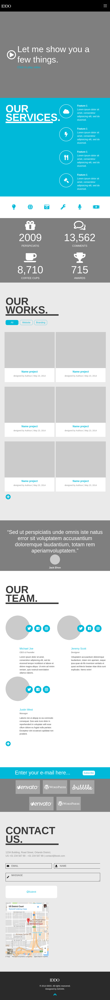
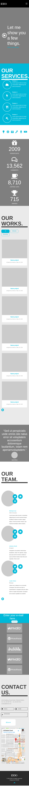

# psdToPage
### [Demo](http://rogala.it/page1/)
Time realization: 11:30h.

## How to build 
[Install gulp](https://github.com/leszek3737/Gulp-Config-Files)
and install:
```
npm i jquery popper.js bootstrap@4.0.0-beta.3
```
Build application in developer mode

```
gulp build
```
Build application in production mode

```
gulp build::prod
```

### Change list 
#### 0.1.1
Add support to iphone 5* and SE
Add modal in works & fix problem in size in icon i works


## Screen





